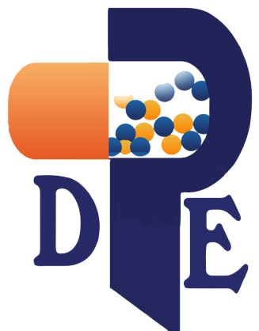

<div align="center">
  

  <h1>Drug Pharma Egypt</h1>

  <p><strong>Bilingual full-stack rebuild of the corporate website, product catalog, and content management system for an Egyptian pharmaceutical manufacturer.</strong></p>

  <p>
    <a href="https://wa.msknalghrb.com/"></a>
    <a href="https://drugpharmaeg.com/"></a>
  </p>

  <p>
    
    
    
    
    
    
  </p>
</div>

---

## Overview

Drug Pharma Egypt is a startup Egyptian pharmaceutical company established in 2016, with a focused portfolio of nutraceutical and pharmaceutical products manufactured in an NFSA-approved facility in New Cairo. The company specialises in pediatric, orthopedic, and gynecological formulations, complemented by an over-the-counter range and a full pharmaceutical line spanning thirty-one active products across five therapeutic categories.

This repository contains the complete rebuild of the company's digital presence: a public-facing bilingual marketing and product catalog, a Filament-powered admin panel for the in-house team, and a REST API that powers the front-end. The original site at [drugpharmaeg.com](https://drugpharmaeg.com/) has been rebuilt from the ground up with a refreshed visual identity, a modernised stack, full Arabic and English support, and a custom-designed admin experience. The new build is currently deployed for review at [wa.msknalghrb.com](https://wa.msknalghrb.com/).

The project ships with SQLite as the default database, requiring no external setup, and seeds the catalog automatically on first run with all five therapeutic categories and thirty-one real products complete with composition, uses, dosage information, and product imagery.

## Architecture

The project is split into two coordinated applications served from a single repository. The `backend/` directory contains a Laravel 11 application that serves both the REST API consumed by the front-end and a Filament v3 admin panel for non-technical content management; the same database powers both surfaces. The `frontend/` directory contains a React 18 single-page application built with Vite and Tailwind CSS, consuming the Laravel API and rendering the public-facing website. The default SQLite database is designed to migrate cleanly to MySQL or PostgreSQL for production deployment by changing a single `.env` value.

## Public Website

The public site is fully bilingual, with Arabic and English support including right-to-left layout and automatic font switching to Cairo for Arabic content. The catalog covers five therapeutic categories with thirty-one product detail pages, a unified products page with category filtering and live search, and a five-section homepage that progresses from a brand hero through a trust strip, a categories grid, featured products, and a final call-to-action. Custom-illustrated SVG hero sections in the brand palette replace generic stock photography on the homepage, About, and Contact pages. The contact form is wired to a throttled API endpoint, includes topic categorisation, and is paired with an embedded OpenStreetMap. Both About and Contact pages include their own narrative arc — story timeline and three product pillars on About, and a comprehensive FAQ section on Contact.

## Admin Panel

The Filament v3 admin panel is fully customised to match the brand identity. Sign-in uses a split-screen layout with a navy gradient brand panel on one side and a clean form on the other, featuring an embedded language toggle and, in development, a one-click demo credentials hint. The dashboard is rebuilt from scratch as a custom page extending `Filament\Pages\Dashboard`, with a 12-column grid hosting four widgets: a gradient hero banner with a personalised greeting and live stats, a four-card KPI metrics row, a quick-actions grid for the most common tasks, and a recent-messages inbox. CRUD coverage spans products, categories, and incoming contact messages, with image uploads, slug auto-generation, featured-product toggles, unread-message badges in the sidebar, and a tabbed product editor covering basics, clinical details, image management, and visibility flags.

## Internationalisation

Locale switching is handled by a single `GET /locale/{locale}` route that writes the chosen language to the session, after which the `AppServiceProvider` boot hook applies it to every subsequent request. The same Blade partial (`filament/partials/lang-toggle.blade.php`) is reused via render hooks on both the login page and the admin topbar, ensuring a consistent toggle experience across all surfaces. Translation coverage on the admin side spans navigation groups, resource names, form fields, table columns, and dashboard widgets via Laravel translation files at `lang/{en,ar}/admin.php`.

The React front-end uses its own `LanguageProvider` (in `src/i18n/`) backed by `localStorage`, mirroring the same EN/AR pair on the public site, with the language toggle exposed in the header utility bar.

## Tech Stack

The backend is built on PHP 8.2 with Laravel 11.31, Filament 3.2 for the admin panel, and SQLite for default persistence. The front-end uses React 18 with Vite, Tailwind CSS 3.4, React Router 6 for routing, and Axios for HTTP. Brand typography combines Outfit (display), DM Sans (body), and Cairo (Arabic) loaded from Google Fonts. The colour system is built on a navy primary (`#1B2360`), an orange secondary (`#E87330`), and a peach surface tone (`#FBE3D2`).

## Project Structure

```
drug-pharma-app/
├── backend/                              # Laravel 11 + Filament v3
│   ├── app/
│   │   ├── Filament/
│   │   │   ├── Pages/
│   │   │   │   ├── Auth/Login.php        # Custom branded login
│   │   │   │   └── Dashboard.php         # Custom dashboard layout
│   │   │   ├── Resources/                # Category, Product, Message
│   │   │   └── Widgets/                  # Hero, Metrics, Actions, Inbox
│   │   ├── Models/                       # Category, Product, ContactMessage
│   │   └── Providers/Filament/AdminPanelProvider.php
│   ├── database/seeders/                 # 5 categories + 31 real products
│   ├── lang/{en,ar}/admin.php            # Admin translation files
│   ├── resources/views/filament/         # Custom Blade views (login, widgets, partials)
│   └── routes/{api,web}.php
├── frontend/                             # React 18 + Vite + Tailwind
│   ├── src/
│   │   ├── components/                   # Header, Footer, ProductCard, Illustrations
│   │   ├── pages/                        # Home, Products, ProductDetail, About, Contact, NotFound
│   │   ├── i18n/                         # LanguageProvider + EN/AR translations
│   │   ├── lib/                          # api.js (Axios), useAsync.js
│   │   └── App.jsx, main.jsx, index.css
│   └── public/logo.png
├── setup.bat                             # Windows one-click setup
├── setup.sh                              # Linux / macOS setup
└── README.md
```

## Quick Start

### Windows (Laravel Herd)

Make sure Laravel Herd is installed from [herd.laravel.com](https://herd.laravel.com), or that PHP 8.2+, Composer, and Node 18+ are on your PATH. From the project root, double-click `setup.bat` and wait three to five minutes for the dependencies to install. Once the script finishes, open two terminals to run the development servers:

```cmd
:: Terminal 1 — Laravel API + admin panel
cd backend
php artisan serve

:: Terminal 2 — React front-end
cd frontend
npm run dev
```

Open `http://localhost:5173` for the public site, `http://localhost:8000/admin` for the admin panel, and sign in with `admin@drugpharmaeg.com` / `password`.

### Linux / macOS

```bash
chmod +x setup.sh
./setup.sh

# Then start each server in its own terminal:
cd backend && php artisan serve
cd frontend && npm run dev
```

### Manual Setup (if the scripts fail)

```bash
# Backend
cd backend
composer install
cp .env.example .env
php artisan key:generate
php artisan migrate:fresh --seed
php artisan storage:link
php artisan serve

# Frontend (in a second terminal)
cd frontend
cp .env.example .env
npm install
npm run dev
```

## API Reference

All endpoints are versioned under `/api/v1/` and return JSON. The catalog endpoints are public; the contact endpoint is rate-limited to five submissions per minute per IP.

| Method | Endpoint                       | Description                                                                |
|--------|--------------------------------|----------------------------------------------------------------------------|
| GET    | `/api/v1/categories`           | All active categories with product counts                                  |
| GET    | `/api/v1/categories/{slug}`    | Single category and its products                                           |
| GET    | `/api/v1/products`             | Paginated list, filterable by `category`, `search`, `featured`, `per_page` |
| GET    | `/api/v1/products/featured`    | Featured strip used on the home page                                       |
| GET    | `/api/v1/products/{slug}`      | Single product with four related products                                  |
| POST   | `/api/v1/contact`              | Submit a contact form message (5 req/min/IP)                               |

## Customising the Project

To add or edit products, sign in to `/admin`, navigate to **Catalog → Products**, and use the tabbed editor. Image upload, slug generation, and drag-to-reorder all work out of the box. Brand colours on the public site are defined in `frontend/src/index.css` (the `:root` block) and `frontend/tailwind.config.js`; brand colours in the admin panel are defined in `backend/app/Providers/Filament/AdminPanelProvider.php` under the `->colors([...])` call. UI strings on the public site live in `frontend/src/i18n/index.jsx`, and admin labels live in `backend/lang/{en,ar}/admin.php`. To add a new locale, copy one of the existing language directories under `lang/`, translate the values, and add the locale code to the route validation in `routes/web.php`.

## Troubleshooting

**`php is not recognized`** — Install Laravel Herd on Windows from [herd.laravel.com](https://herd.laravel.com), or ensure your installed PHP binary is added to the system PATH.

**`composer not found`** — Add Composer to PATH after installation, or run the installer from [getcomposer.org](https://getcomposer.org/) and restart your terminal.

**SQLite errors** — The setup script pre-creates `database/database.sqlite` as an empty file. If you delete it by accident, simply create an empty file again with that exact name and re-run the migrations.

**Admin login redirects** — Ensure `database/database.sqlite` was migrated successfully and the users table exists. Re-run `php artisan migrate:fresh --seed` from the `backend/` directory.

**Port conflicts** — Vite uses port 5173 and Artisan uses port 8000 by default. Override either with `php artisan serve --port=8001` or by editing the `server.port` value in `frontend/vite.config.js`.

**Composer slow or hanging** — Switch to the official packagist mirror with `composer config --global repos.packagist composer https://repo.packagist.org` and retry.

**Language toggle not switching** — Clear the view and config caches: `php artisan view:clear && php artisan config:clear`. The locale is persisted in the session, so the change applies on the next request.

## Production Deployment

For production, switch the `DB_CONNECTION` value in `backend/.env` to `mysql` or `pgsql`, set the corresponding credentials, create the database, and re-run `php artisan migrate:fresh --seed`. The front-end production bundle is produced with `npm run build` from the `frontend/` directory, after which the resulting `dist/` folder can be deployed to any static host or proxied behind the Laravel application. Update `FRONTEND_URL` in `backend/.env` and the allowed origin in `backend/config/cors.php` to match the production hostname. The `canAccessPanel` method on `app/Models/User.php` should be edited to restrict admin access by email domain or role before going live, and the seeded administrator account at `admin@drugpharmaeg.com` must either be removed or have its password rotated.

## Credits

Designed, developed, and maintained by **Business Partner for Information Technology** (شريك الأعمال) — a Cairo-based digital agency specialising in web development, e-commerce, and visual identity for clients across Egypt, Saudi Arabia, and the broader Arab region.

## License

This project is a commissioned commercial work. All product imagery, brand assets, and the Drug Pharma Egypt name remain the property of Drug Pharma Egypt. Source code is provided under the terms agreed between Drug Pharma Egypt and Business Partner for Information Technology.
